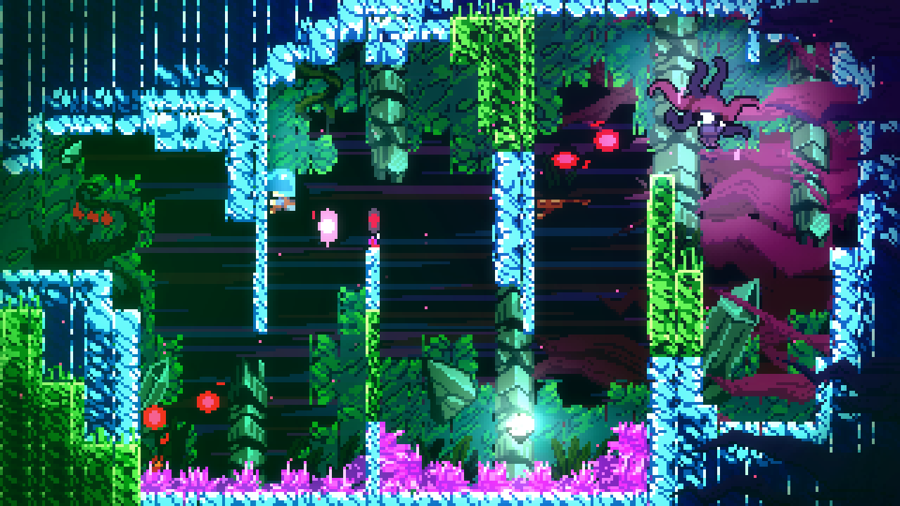

# Glitchleste

[Showcase video](https://youtu.be/B7qC5uzu76w)

---

This mod makes the game rendered incorrectly by simulating rendering when the whole level is moved to very large positions, causing [floating-points precision loss](https://en.wikipedia.org/wiki/Loss_of_significance)

You can also adjust glitch level per axis in mod options.

## Installing

You can download the latest version on [GameBanana](https://gamebanana.com/mods/371840) or [GitHub releases](https://github.com/WEGFan/Celeste-Glitchleste/releases).

[Everest](https://everestapi.github.io/) is required to enable modding for Celeste.
